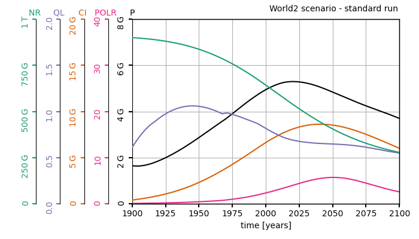
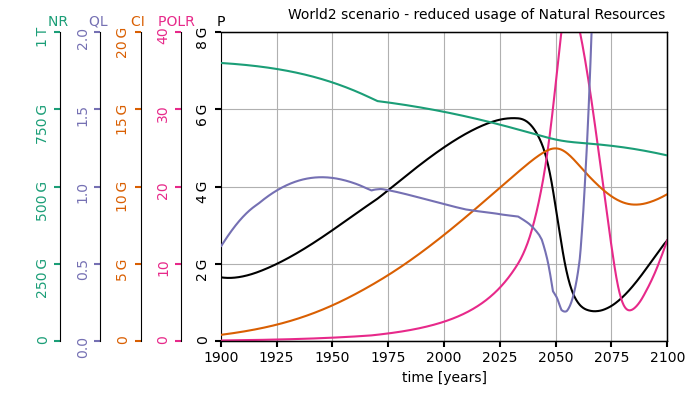
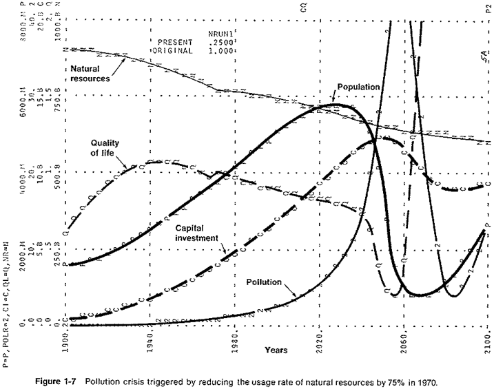

> A Python implementation of the World2 model

[](https://zenodo.org/badge/latestdoi/306612326)
[](https://opensource.org/licenses/MIT)

+ [Quick install](#Quick-install)
+ [Hello World2](#Hello-World2)
+ [How to go further](#How-to-go-further)
+ [How to cite the projet with Bibtex](#How-to-cite-the-project-with-Bibtex)
+ [References & acknowledgment](#References-&-acknowledgment)

---

PyWorld2 is a Python implementation of the World2 model, designed by Jay W. Forrester to predict trajectories of growth-focused Humankind in a world bounded by its physical limits. The model structure is thouroughly described in the book *World Dynamics*. Although World3 later became the reference, World2 is much less complex than its successor: it helps to get a good understanding of how the world could be modeled by a System Dynamics approach. World2 is a nonlinear 5-th order differential equation model with the following state variables:
- human population `P`,
- nonreplaceable natural resources `NR`,
- pollution `POL`,
- capital investement `CI`,
- and the fraction of capital devoted to agriculture `CIAF`.

# Quick install

The easiest way to install pyworld2 is via pip:
```
pip install pyworld2
```

It will automatically install the requirements ``numpy``, ``scipy`` and ``matplotlib``. Otherwise you can clone the repository and do:

```
python setup.py install
```

# Hello World2

Run the provided example:
``` Python
import pyworld2
pyworld2.hello_world2()
```
It simulates the 2 scenarios described in the Forrester's book:
* the standard run, or *Business as Usual*
* an hypothetical scenario where the usage rate of Natural Resources is reduced by 75% in 1970.

Below is a comparaison with the original figures. They plot the population `P`, pollution rate `POLR`, capital investment `CI`, quality of life `QL` and natural resources `NR`.

|Standard run - *Business as usual*          |  Reduced usage of Natural Resources       |
|:------------------------------------------:|:-----------------------------------------:|
|         |           |
|  |    |


# How to go further

If you want to run your own simulations with different policies, you need to:
* copy-paste the configuration file ``./pyworld2/functions_switch_default.json`` into your current directory 
* modify it at your convenience. Each policy is defined by its due date and its due variable (``NAME`` switches to ``NAME1`` at the year ``trigger.value``).
* Finally, run the following lines of code:
``` Python
import pyworld2

w2 = World2()
w2.set_state_variables()
w2.set_initial_state()
w2.set_table_functions()
w2.set_switch_functions("./functions_switch_modified.json")
w2.run()

pyworld2.utils.plot_world_state(w2)
```

# How to cite the project with Bibtex

The project is under the MIT Licence & open-source --- see the [licence terms](./LICENCE). To cite PyWorld2 via BibTex:
```
@software{vanwynsberghe2020pyworld2,
  author       = {Charles Vanwynsberghe},
  title        = {{PyWorld2 - a Python implementation of the World2 
                   model.}},
  month        = nov,
  year         = 2020,
  publisher    = {Zenodo},
  version      = {v1.1},
  doi          = {10.5281/zenodo.4274586},
  url          = {https://doi.org/10.5281/zenodo.4274586}
}
```

# References & acknowledgment

PyWorld2 is forked from the [Rworld2 Software](https://github.com/amignan/hist_gc_sysdyn) held by Arnaud Mignan.

- *World Dynamics*, Jay W. Forrester (1973 second edition)
- [RWorld2: reproducing doomsday models in R](https://github.com/amignan/hist_gc_sysdyn), Arnaud Mignan (2020). 